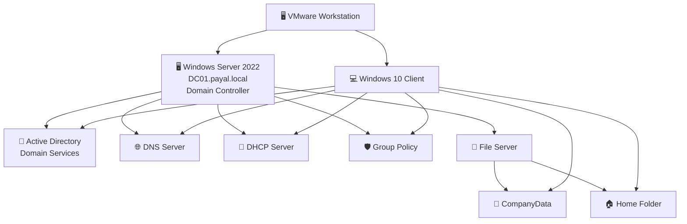

```mermaid
flowchart TD

    A["🖥️ VMware Workstation"]

    A --> B["🖥️ Windows Server 2022<br/>DC01.payal.local<br/>Domain Controller"]

    B --> C["🔐 Active Directory<br/>Domain Services"]

    B --> D["🌐 DNS Server"]

    B --> E["📡 DHCP Server"]

    B --> F["🛡️ Group Policy"]

    B --> G["📂 File Server"]

    G --> H["📁 CompanyData"]

    G --> I["🏠 Home Folder"]

    A --> J["💻 Windows 10 Client"]

    J --> C

    J --> D

    J --> E

    J --> F

    J --> H

    J --> I
```
