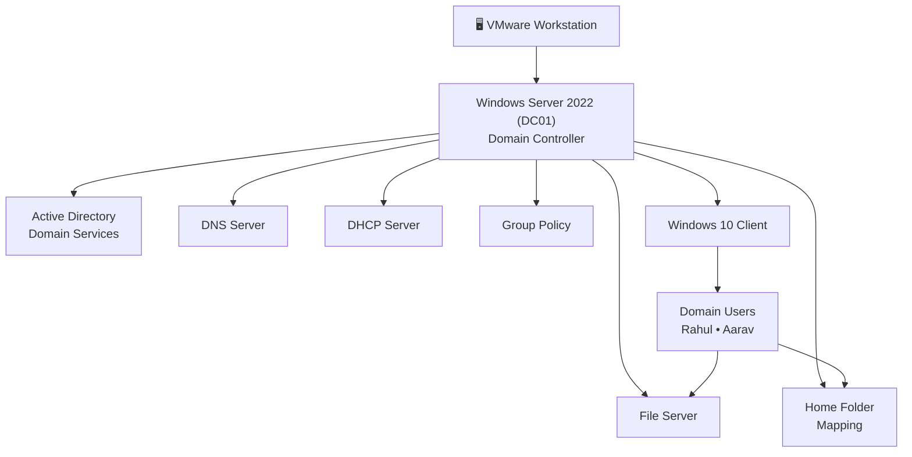

# 🏗️ Enterprise Active Directory Lab Architecture

```mermaid
flowchart TB

    VM["🖥️ VMware Workstation"]

    DC["Windows Server 2022 (DC01)<br/>Domain Controller"]

    AD["Active Directory<br/>Domain Services"]

    DNS["DNS Server"]

    DHCP["DHCP Server"]

    GPO["Group Policy"]

    FS["File Server"]

    HF["Home Folder<br/>Mapping"]

    CLIENT["Windows 10 Client"]

    USER["Domain Users<br/>Rahul • Aarav"]

    VM --> DC

    DC --> AD
    DC --> DNS
    DC --> DHCP
    DC --> GPO
    DC --> FS
    DC --> HF

    DC --> CLIENT

    CLIENT --> USER

    USER --> FS

    USER --> HF
```
