# 📸 Enterprise Active Directory Lab - Screenshots

This folder contains screenshots captured during the implementation of the **Enterprise Active Directory Lab** using **Windows Server 2022** and **VMware Workstation**.

Each screenshot represents a major milestone completed during the lab.

---

# 🏗️ Enterprise Lab Architecture

The overall architecture of the Active Directory Lab environment.

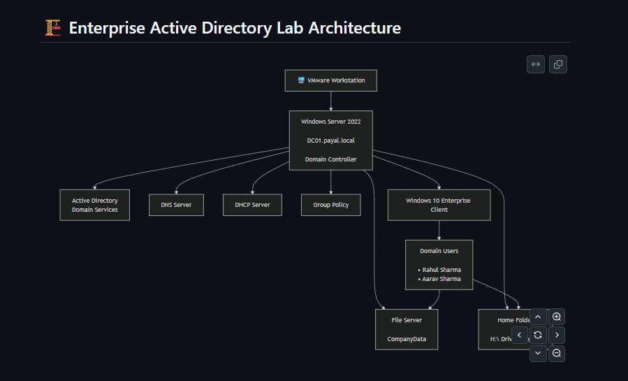

---

# 🖥️ 1. Windows Server 2022

Configured Windows Server 2022 as the **Domain Controller (DC01)** for the **payal.local** domain.

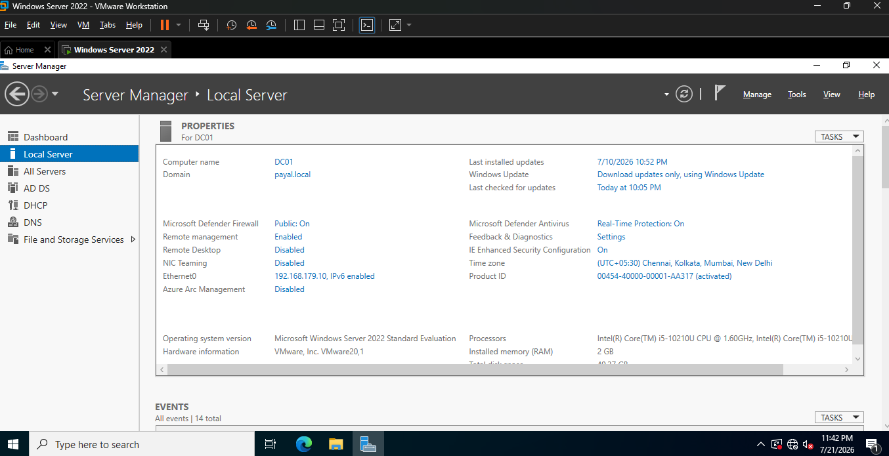

---

# 👥 2. Active Directory Users & Groups

Created Organizational Units (OUs), domain users, and security groups to simulate an enterprise environment.

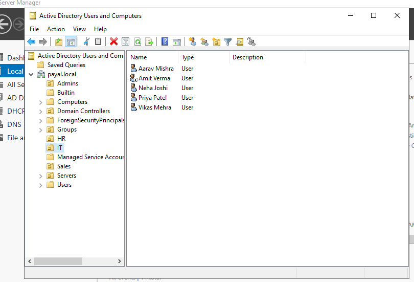

---

# 🌐 3. DNS Configuration

Configured the DNS Server with Forward Lookup Zones and DNS records for internal name resolution.

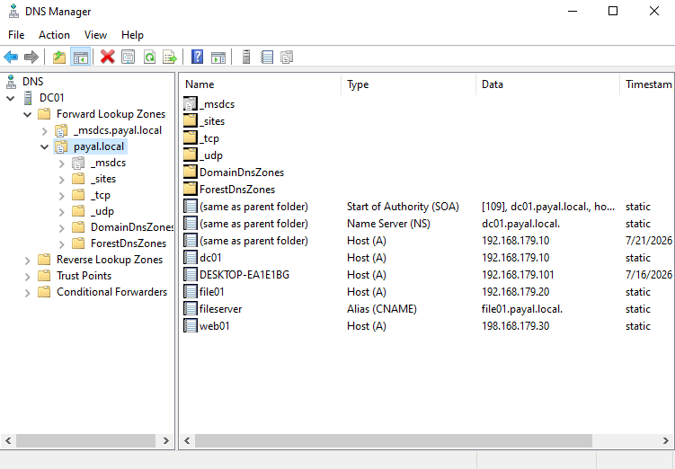

---

# 📡 4. DHCP Configuration

Configured the DHCP Scope for automatic IP address allocation to domain clients.

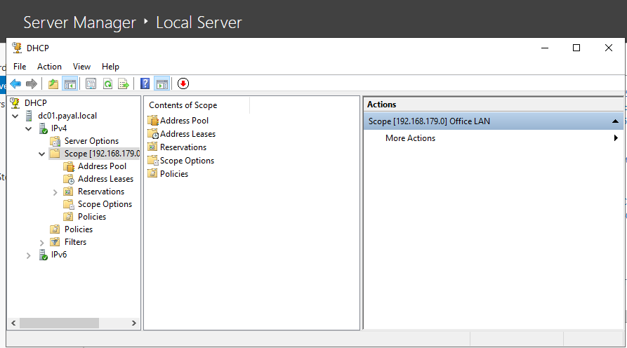

---

# 🛡️ 5. Group Policy Management

Implemented Group Policy Objects (GPOs) to centrally manage user and computer settings.

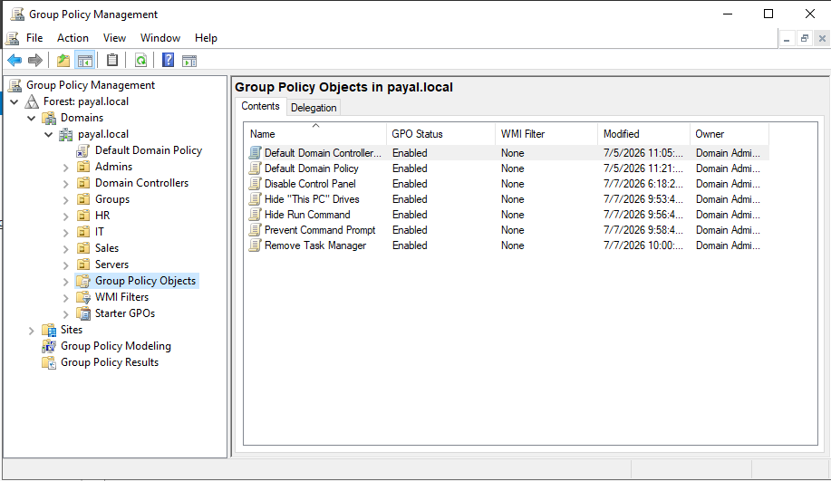

---

# 💻 6. Windows 10 Domain Login

Successfully joined the Windows 10 client machine to the **payal.local** domain.

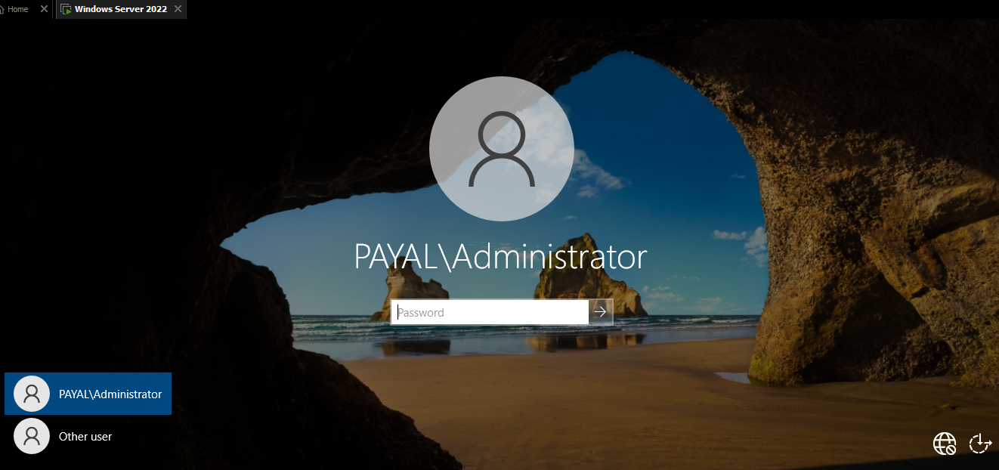

---

# 📂 7. CompanyData Shared Folder

Configured the **CompanyData** shared folder for departmental file sharing.

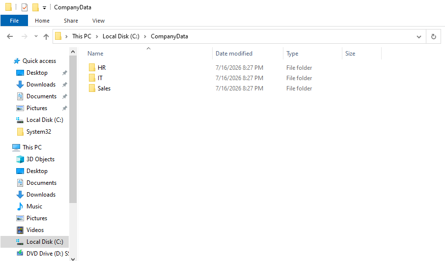

---

# 🔐 8. NTFS Permissions

Configured NTFS permissions to provide secure department-wise access to shared folders.

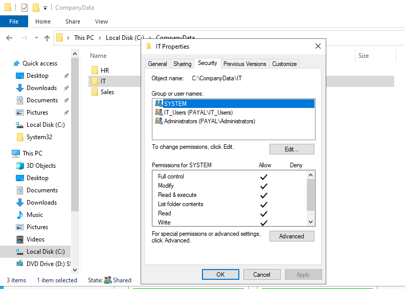

---

# 🤝 9. Advanced Sharing

Configured SMB Advanced Sharing settings for the CompanyData shared folder.

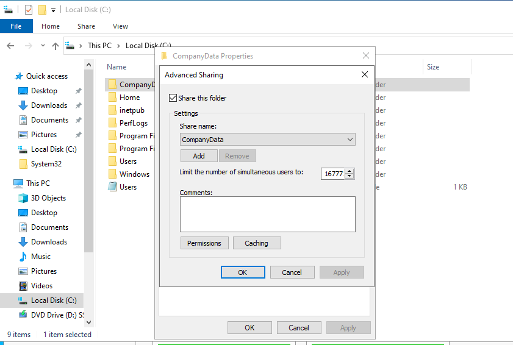

---

# 🏠 10. Home Folder Mapping

Configured user Home Folder mapping using the **H:** drive.

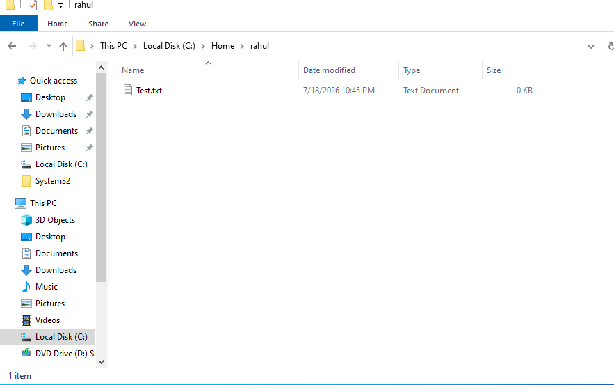

---

# ⚡ 11. PowerShell Administration

Performed Active Directory administration tasks using PowerShell cmdlets.

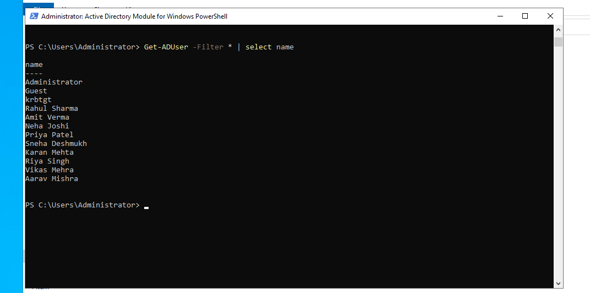

---

## ✅ Summary

This screenshot gallery demonstrates the successful implementation of an **Enterprise Active Directory Environment**, covering:

- Windows Server 2022 Installation
- Active Directory Domain Services (AD DS)
- DNS Configuration
- DHCP Configuration
- Group Policy Management
- Windows Client Domain Join
- File Server Configuration
- NTFS Permissions
- Advanced Sharing
- Home Folder Mapping
- PowerShell Administration

---
